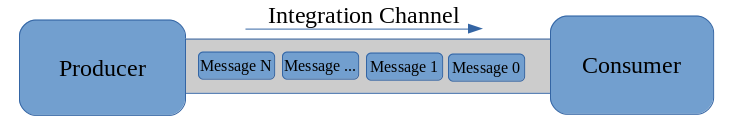
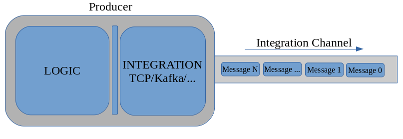
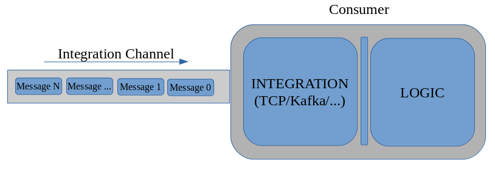
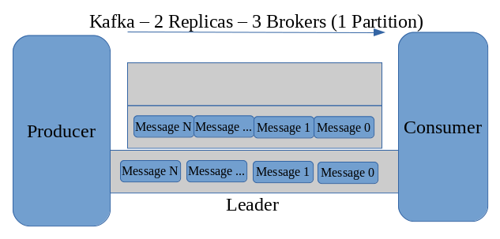

#Simplified Fault-Tolerant Streaming Data Pipeline
*(Using Spring Boot, Spring Integration, Kafka and Docker Swarm)*

##Introduction:

###Streaming Data Pipeline:

Let's first define what we understand here as a "streaming data
pipeline". For the sake of simplicity, we are going to define it simply
in terms of the *producer/consumer pattern*. So we are going to have
*two processes* sharing data by means of a *channel* which
*asynchronously* communicates them in one single direction:



Despite the fact that this simple model proposes an uni-directional
channel, note that it renders the most basic form of processes
integration by means of asynchronous messaging, which is the
foundational stone for every micro-service architecture.

###Fault Tolerance:

Now let's define what we will be considering as *a failure*:
Let's say a failure will be any event that will, in some way or
another, derive in *data loss.* In general, in this context there may be
three types of failure:

1. *Producer* goes down temporarily or definitely.

2. *Consumer* goes down temporarily or definitely.

3. *Integration Channel* goes down temporarily or definitely.

In this article we are going to focus on a subset of the third type: a
temporary failure in the integration channel.

###Resilience:

In order to overcome a temporary failure in the integration channel used
between our producer and consumer, we need to avoid the presence of any
single point of failure. Usually, clustered systems are the mainstream
regarding resilient software technologies, as they provide the means to
deploy software layers composed by several nodes acting as one single
entity, the "cluster". As failures are thought to happen only to one or
several of the composing nodes, the clustered systems have the ability
to keep working in the presence of failures.\
In our case, we are going to use a clustered system for streaming data
channels, this is: Kafka, a "distributed streaming platform".

##Implementation:

For the implementation of the two processes we are going to use *Spring
Boot* that will help us on easily getting important pieces of our
runtime environment together, and *Spring Integration* that will help us
to nicely decouple the *logic* of our producer and consumer from the
*integration* means that we will be using.

###The producer:

####Logic:

The core of the logic of our producer is basically an infinite loop that
will be producing mock updates at a configurable throughput. Each update
is identified by a sequence number increasing by 1 with each update
produced. It is implemented in the TestProducer object as follows:

```java
 while (true) {

    Thread.sleep(throughput);

    for(int i = 0; i < N; i++) {
        update = new Update(sequece.getAndIncrement(), senderUUID, System.currentTimeMillis());
        senders.forEach((sender) -> sender.send(update));
    }
 }
```

The TestProducer object holds as an attribute a set of the so called
"senders" that will be taking care of how messages are delivered. In
other words, senders are the fundamental entities abstracting the
integration stuff for the producers.

####Integration:

In our case, the "Sender" object is "*that thin layer of code that
attaches the application to*

*the messaging system*" (Enterprise Integration Patterns. *Message
Endpoints*. p. 415). If you dig in our code, you may notice how our
logic implementation (both in the producer and the consumer) can
actually work seamlessly either with TCP or Kafka, and potentially with
any given integration system thanks to this "Sender" abstraction.\
For a glance compare this small snippets from our TCP and Kafka
producers implementations.

More or less, this is what you will find in the TCPProducer:

```java
    @Autowired
    private TcpProducerConfiguration.Gateway tcpGateway;
    private TestProducer producer = new TestProducer(throughput, N, producerUUID);

    @Override
    public void onApplicationEvent(TcpConnectionOpenEvent event) {
        producer.addSender(new Sender(tcpGateway, event.getConnectionId()));
        producer.start();
    }
```



And, more or less, this is what you will find on the KafkaProducer:

```java
    @Autowired
    private KafkaProducerConfiguration.Gateway kafkaGateway;

    private TestProducer producer;

    @PostConstruct
    private void init() {
        producer = new TestProducer(throughput, N, producerUUID);
        producer.addSender(new Sender(kafkaGateway, properties.getTopic()));
        producer.start();
    }
```

###The consumer:

####Logic:

As our experiment is focused on detecting data loss in our system
happening as consequence of a temporary failure in the integration
channel, our consumer logic is implemented as an "integrity verifier".
Basically, it will review from time to time that there are no gaps in
the updates identifiers received in the last lapse of time. As updates
are identified by a sequence number which uniformly increases by one
with each update produced, the ordered set of all *N* updates'
identifiers gathered in the batch being verified must be a sequence of
integers in which *(i +1) - i = 1 for every i in set*.

For a glance on how this works, have a look at these tests:

```java
    @Test
    public void dataLossFalse() {
        IntegrityVerifierConsumer verifierConsumer = new IntegrityVerifierConsumer();
        String sender = "sender1";
        Update update = new Update(1000, sender, 0);
        verifierConsumer.consume(update);
        update = new Update(1001, sender, 1);
        verifierConsumer.consume(update);
        update = new Update(1002, sender, 2);
        verifierConsumer.consume(update);
        assertFalse(verifierConsumer.dataLoss(sender));
    }
 
    @Test
    public void dataLossTrue() {
        IntegrityVerifierConsumer verifierConsumer = new IntegrityVerifierConsumer();
        String sender = "sender1";
        Update update = new Update(1000, sender, 0);
        verifierConsumer.consume(update);
        update = new Update(1001, sender, 1);
        verifierConsumer.consume(update);
        update = new Update(1003, sender, 2);
        verifierConsumer.consume(update);
        assertTrue(verifierConsumer.dataLoss(sender));
    }
```

####Integration:

As with the producer logic, the consumer logic does not have any
concerns regarding what kind of integration channel the updates it
consumes are being gathered from. All it knows is that it "consume*"
*method was called with an update passed to it.\
Whereas the producer uses the Sender object (which in turn wraps a
messaging gateway implementation) as messaging endpoint, the consumer is
using a "service activator" endpoint.\
For a glance, have a look at this snippet which implements both the TCP
and Kafka service activator and delivers the updates received to the
IntegrityVerifierConsumer object:

```java
public class ExampleConsumerImpl { 

    private List<Consumer> consumers = new ArrayList<>();

    public ExampleConsumerImpl() {
        consumers.add(new IntegrityVerifierConsumer());
    }

    private void process(Update update) {
        consumers.forEach(consumer -> consumer.consume(update));
    }

    @ServiceActivator(inputChannel = "kafkaServiceChannel")
    public void kafkaToService(Update update) {
        process(update);
    }

    @ServiceActivator(inputChannel = "tcpServiceChannel")
    public void tcpToService(Update update) {
    process(update);
    }
}
```



###The integration channel:

As said before, we are going to use Kafka as our integration channel and
the feature from it that we are going to focus on is its ability to keep
doing its job even when failures come up.
As a clustered system, Kafka is implemented as a set of nodes working
together as a single entity. Each node is called a "broker" in the Kafka
architecture. Brokers are in charge of handling message channels which
are called "topics". As message channels, these topics have the
particular characteristic that they implement the so called "partitions"
meant for parallel processing in several ways.

Each topic is created with a given number of partitions and a given
replication factor.
This is how the Spring Integration code used in our producer creates the
topic that it will be using:

```java
    @Value("${kafka.replicas}")
    private short replicas;

    @Bean
    public NewTopic topic(KafkaAppProperties properties) {
        return TopicBuilder.name(properties.getTopic())
                           .partitions(1)
                           .replicas(replicas)
                           .build();
    }
```
Kafka will complain if the given replication factor is greater than the
number of brokers available in the cluster. If there are enough brokers,
Kafka will create the required replicas, each on a different broker and
will designate one of them as the so called "leader". That one will be
taking care of delivering messages between producers and consumers and,
whenever a failure makes the leader to go down, Kafka (by means of Zookeeper) will designate a new leader if there is one
available.
(Note that each broker does not necessarily run on a different host, although advisable. 
Production deployments usually use a broker per container.)



###Deployment:

Our code provides Dockerfiles for producer and consumer and also the
docker-compose YAML files for deploying the whole systems using Docker
Swarm. On a development environment these tools can be deployed using
Docker Machine, and that is what we are going show as follows.

##The swarm:

The first step is to create the docker machines and join all them into a
swarm. After that, we need to deploy a private registry as a service in
our swarm. It will be serving image handling service for all of our
swarm nodes. There are plenty of documents out there describing how to
do these two initial steps.

Each time you make a modification to producer or consumer code, you will
need to push the image to the registry so it will available to all nodes
in the swarm.

We use this simple script for that:

```shell script
#!/bin/bash

REGISTRY_IP=Your.Registry.I.P

TAG=$REGISTRY_IP/$1:latest

DOCKERFILE=producer/docker/Dockerfile

gradle $1:build

docker build -t $TAG -f $DOCKERFILE .

docker push $TAG
```

It is in docker/setup_image.sh and must be used like this:

```shell script
sh docker/setup_image.sh producer ← For the producer
sh docker/setup_image.sh consumer ← For the consumer
```

You will also need to pull an appropriated Kafka image (we suggest
wurstmeister/kafka), tag it and push it to our registry in order to make
it available for all the swarm nodes.

Once we have all the images in place, this is, in our private registry 
we must deploy the whole stack. Our repository provides simple scripts for doing this. 
By setting appropriately the REGISTRY_IP environment variable, you should only need to
issue this command to have all the system deployed:

```shell script
sh docker/deploy-producer-consumer-kafka-stack.sh
```

